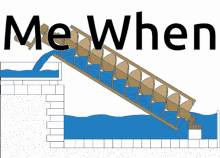
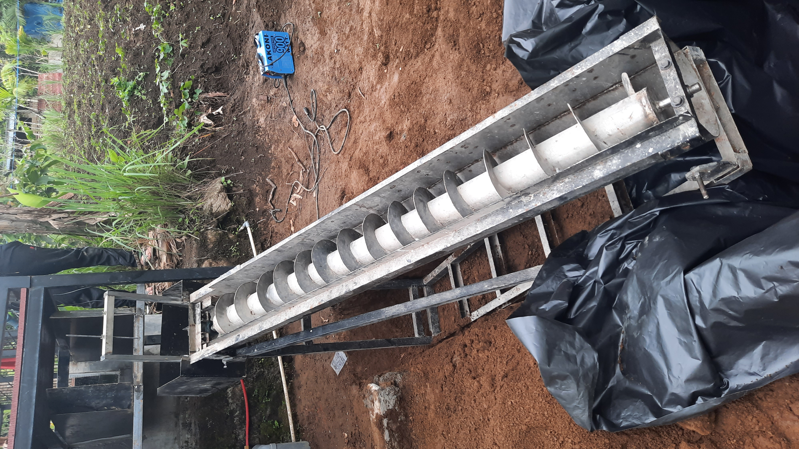
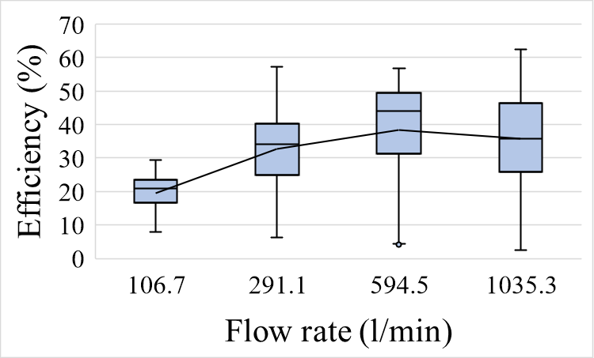
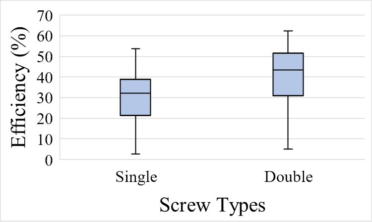
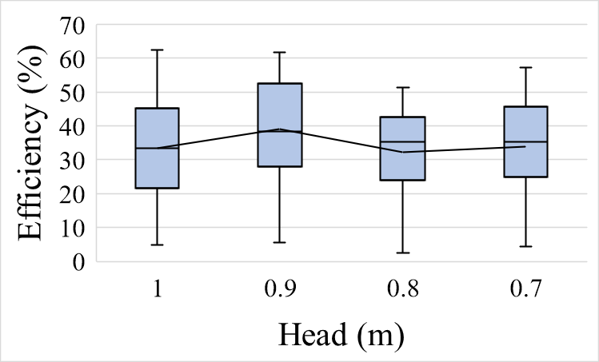
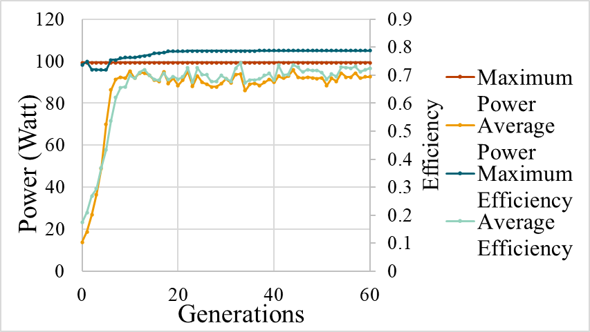

This is a personal archive of my undergraduate thesis on Archimedes screw turbine optimization - 2024

### Abstract
The increasing need for sustainable energy solutions makes microhydro systems, specifically the Archimedes Screw Turbine (AST), a viable option for low-head sites due to its environmental suitability and ease of operation. To improve its performance, this study explores the comparative effectiveness of two optimization methods: Analysis of Variance (ANOVA) and Genetic Algorithm (GA). Experimental tests were conducted on single and double screw turbines with varying head (0.7-1.0 m) and flow rate (106-1035 l/min). ANOVA was used to evaluate the statistical significance and interaction between parameters on efficiency, while GA was applied to determine the optimal configuration that maximizes turbine output. Results showed that screw type and flow rate had a highly significant effect on turbine efficiency (p < 0.001), while head variation showed no significant effect. The GA successfully identified the optimal configuration at a head of 0.95 m and a flow rate of 814.8 l/min with a double screw, resulting in a mechanical power of 99.35 W with an efficiency of 78.73%. These findings suggest that statistical and evolutionary optimization methods can complement each other in evaluating and improving AST performance. The novelty of this study lies in the integrative approach of comparing ANOVA and GA in one experimental framework for screw turbine optimization, which can serve as a strong reference for future micro-hydro designs. Further research is recommended to evaluate a wider range of parameters as well as real-time application of adaptive control systems in the field.

## Summary of the study

### Step 1
We collected the data by an experiment.

We ended up with a data on different variance of head, flow rates, and screw type of the turbine.

### Step 2
We performed Analysis of Variance (ANOVA) to see which of the variables actually impacts it the most. We find that the screw type and the flow rate are the primary determinants. 

Figure 1. Correlation between flow rate and efficiency

Figure 2. Correlation between screw types and efficiency

Head height doesn't really impact the efficiency that much, at least on this scale. Which is surprising for me, since this turbine is designed for low-head application, turns out head doesn't impact efficiency that much.

Figure 3. Correlation between head and efficiency

### Step 3

After knowing the variables' impact on the turbine efficiency, we then play god.

Genetic Algorithms (GA) work by "evolving" the configuration until it reaches the optimal state, which, in this case, is maximizing efficiency. 

We first make the initial population, with a random configuration, and then evaluate the efficiency for each one. The higher the efficiency, the higher the score we give. The high score wins and gets to reproduce, while the low score gets eliminated. We do this for hundreds of generations.

Figure 4. Genetic Algorithm convergence

The results converge around the 22nd generation. It identified the optimal configuration at a head of 0.95 m and a flow rate of 814.8 l/min with a double screw, resulting in a mechanical power of 99.35 W with an efficiency of 78.73%.

